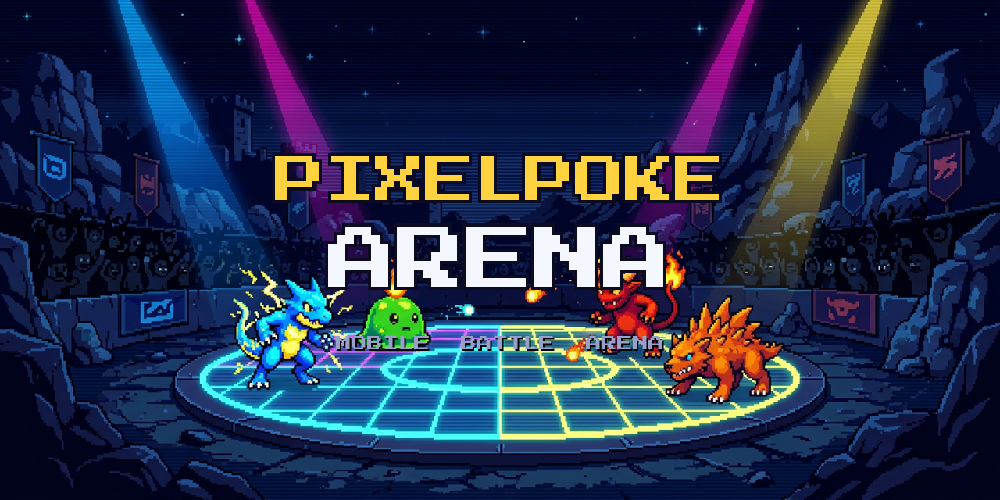

<p align="center">
  
</p>

<p align="center">
  <a href="https://github.com/DLinacre/PixelPokeArena/releases/latest"></a>
  
  
  
  
</p>

# PixelPoke Arena — Android

A native Android app that puts **PixelPoke Arena** — the pixel battle-royale arena — on your home screen as a single, installable APK.

Built as a clean, self-contained WebView wrapper, the app loads the live arena in a full-screen, immersive browser view with a custom pixel-art launcher icon and dark theme. No Play Store required: grab the APK, sideload it, and you're in.

> ⚠️ **Community project** — this is an independent, unofficial wrapper and is **not** affiliated with or endorsed by the PixelPoke Arena team, Nintendo, The Pokémon Company, or Game Freak. PixelPoke Arena is a Web3 game; see [Limitations](#-limitations) below.

---

## ✨ Features

- 📱 **One-tap launch** — a native Android app that opens straight into the arena.
- 🎮 **Full-screen immersive WebView** with dark theme and status-bar matching.
- 🧭 **In-app navigation** — hardware back button walks back through pages.
- 🖼️ **Custom pixel-art branding** — original launcher icon, logo, and banner.
- ⚡ **Lightweight** — ~1 MB APK, min Android 5.0 (API 21).
- 🔒 **Pre-signed for sideloading** — installs directly, no Play Store key needed.

## 📲 Install

1. Download the latest APK from [**Releases**](https://github.com/DLinacre/PixelPokeArena/releases/latest).
2. Open the `.apk` on your device.
3. If prompted, allow **"Install unknown apps"** for your file manager / browser.
4. Tap **Install** and launch **PixelPoke Arena**.

> Rebuilt APKs are also produced automatically by CI on every push — see [Actions](https://github.com/DLinacre/PixelPokeArena/actions).

## 🛠️ Build from source

```bash
git clone https://github.com/DLinacre/PixelPokeArena.git
cd PixelPokeArena
./gradlew assembleRelease
```

The release APK is written to `app/build/outputs/apk/release/app-release.apk`.

**Requirements:** JDK 11+ and the Android SDK (platform 33, build-tools 33.0.2). The release build signs with a local keystore at `keystore/release.keystore` — generate one with:

```bash
keytool -genkeypair -v -keystore keystore/release.keystore -alias arena \
  -keyalg RSA -keysize 2048 -validity 10000 \
  -storepass pixelarena -keypass pixelarena \
  -dname "CN=PixelPoke Arena, OU=Dev, O=Arena, C=GB"
```

## 🧱 Project structure

```
.
├── app/
│   ├── src/main/
│   │   ├── java/com/pokepixelarena/app/MainActivity.java   # WebView host activity
│   │   ├── res/                                           # icon, theme, strings
│   │   └── AndroidManifest.xml
│   └── build.gradle
├── artwork/                                               # banner, logo, icon
├── .github/workflows/build.yml                             # CI: build + upload APK
├── gradle/ + gradlew                                       # Gradle wrapper
└── build.gradle / settings.gradle
```

## 🔎 How it works

`MainActivity` hosts an Android [`WebView`](https://developer.android.com/reference/android/webkit/WebView) pointed at the live arena. JavaScript and DOM storage are enabled, mixed content is allowed, and state is preserved across rotation and backgrounding. That's the whole app — deliberately simple, easy to audit, and easy to maintain.

## ⚠️ Limitations

PixelPoke Arena is a **Web3 battle-royale**: entering battles requires connecting a **Phantom wallet** holding 25,000 `$POKE`. Phantom connects via a browser extension or deep-link, which a sandboxed Android `WebView` cannot provide.

- ✅ Browsing the arena UI, roster, leaderboards, and info pages works.
- ❌ Wallet connection / entering battles does **not** work from within the wrapper.

This is an inherent limitation of any WebView wrapper of a blockchain game, not a bug in this project.

## 📄 License

[MIT](LICENSE) © 2026 David Linacre. The PixelPoke Arena game, its art, and the Pokémon franchise are the property of their respective owners.
